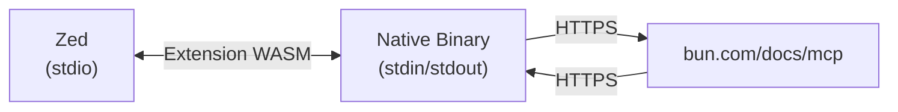

# Architecture

## Overview

This Zed extension provides MCP (Model Context Protocol) integration for searching Bun documentation. It's implemented as a pure Rust binary that communicates with Zed via stdio.

## Components

### 1. Zed Extension (Rust WASM)

- **Location**: [`src/lib.rs`](./src/lib.rs)
- **Purpose**: Implements `context_server_command` to provide the command Zed needs to start the MCP server
- **Build Target**: `wasm32-wasip2`

### 2. MCP Binary (Rust Native)

- **Repository**: [kjanat/bun-docs-mcp-proxy][bun-docs-mcp-proxy]
- **Purpose**: Standalone MCP server that proxies requests to `https://bun.com/docs/mcp`
- **Distribution**: Downloaded automatically from [GitHub Releases][releases]

## Communication Flow



1. **Extension**: Returns command to execute native binary
2. **Binary**: Reads JSON-RPC from stdin, makes HTTPS requests, writes responses to stdout
3. **Zed**: Communicates with binary via stdio pipes

## Platform Support

| Platform | Architecture | Binary Name                              |
| -------- | ------------ | ---------------------------------------- |
| Linux    | `x86_64`     | `bun-docs-mcp-proxy-linux-x86_64`        |
| Linux    | `aarch64`    | `bun-docs-mcp-proxy-linux-aarch64`       |
| macOS    | `x86_64`     | `bun-docs-mcp-proxy-macos-x86_64`        |
| macOS    | `aarch64`    | `bun-docs-mcp-proxy-macos-aarch64`       |
| Windows  | `x86_64`     | `bun-docs-mcp-proxy-windows-x86_64.exe`  |
| Windows  | `aarch64`    | `bun-docs-mcp-proxy-windows-aarch64.exe` |

## Build Process

```bash
# Build extension WASM
cargo build --target wasm32-wasip2 --release
```

The binary is downloaded automatically.  
See: [kjanat/bun-docs-mcp-proxy/releases][releases]

## Migration History

Originally implemented in TypeScript, migrated to pure Rust for:

- **Zero runtime dependencies** - No Node.js or Bun required
- **10x faster startup** - 4ms vs 40ms+ for JavaScript runtimes
- **Smaller footprint** - 2.7 MB vs 50+ MB with runtime
- **Better platform support** - Native binaries for 6 platforms

Migration completed in commit [`16daa94`](https://github.com/kjanat/bun-docs-mcp-zed/commit/16daa94) (November 2025).  
For detailed history, see git log from [`8a68491`](https://github.com/kjanat/bun-docs-mcp-zed/compare/8a68491...HEAD) onward.

[bun-docs-mcp-proxy]: https://github.com/kjanat/bun-docs-mcp-proxy
[releases]: https://github.com/kjanat/bun-docs-mcp-proxy/releases
