# Bun Docs MCP for Zed

Search Bun documentation directly in Zed using the Model Context Protocol (MCP).

**Pure Rust implementation** with zero runtime dependencies.

## Features

- 🔍 **Search Bun Docs** - Query Bun documentation from Zed Assistant
- ⚡ **Pure Rust** - Native binary with automatic download from GitHub Releases
- 🪶 **Lightweight** - 1.3 MB compressed, 2.7 MB extracted
- 🚀 **Fast** - 4ms startup time
- 🌍 **Multi-Platform** - Supports Linux, macOS, Windows (x86_64/ARM64)
- 🔄 **Auto-Update** - Downloads latest binary on installation

## Installation

### From Zed Extensions (Coming Soon)

1. Open Zed
2. `Cmd/Ctrl+Shift+X` → Extensions
3. Search: "Bun Docs MCP"
4. Click Install

### As Dev Extension (Local Development)

```bash
# Clone this repository
git clone https://github.com/kjanat/bun-docs-mcp-zed
cd bun-docs-mcp-zed

# Install in Zed
# Press Cmd/Ctrl+Shift+P
# Type: "zed: install dev extension"
# Select this directory
```

**No build required!** The extension auto-downloads the Rust binary from GitHub Releases on first use.

## Usage

1. **Open Assistant**: `Cmd/Ctrl+Shift+A` (macOS) or `Ctrl+Shift+A` (Linux/Windows)
2. **Enable Context**: Click context dropdown → Enable "bun-docs-mcp"
3. **Ask Questions**: "How does Bun.serve work?"

### Example Queries

```
How does Bun.serve work?
Explain Bun's WebSocket support
What are Bun's TCP APIs?
How do I use Bun.file?
Show me Bun.spawn examples
```

## Architecture

```mermaid
flowchart TD
    A["🔧 Zed Extension (WASM)<br/>• Auto-downloads binary<br/>• Platform detection<br/>• Daily update checks<br/>• Size: 171 KB"]
    B["📦 GitHub Releases<br/>kjanat/bun-docs-mcp-proxy<br/>• 6 platforms supported<br/>• ~1.3 MB compressed"]
    C["⚙️ Rust MCP Proxy (Native)<br/>• stdio ↔ HTTP ↔ SSE<br/>• 2.7 MB extracted<br/>• 4ms startup"]
    D["🌐 Bun Docs API<br/>https://bun.com/docs/mcp"]

    A -->|"downloads from"| B
    B -->|"extracts to /work/"| C
    C -->|"queries"| D

    style A fill:#e1f5ff
    style B fill:#fff4e6
    style C fill:#e8f5e9
    style D fill:#f3e5f5
```



### How It Works

1. **Extension**: Zed loads the WASM extension from this repo
2. **Auto-Download**: On first use, downloads platform-specific binary from [GitHub Releases](https://github.com/kjanat/bun-docs-mcp-proxy/releases)
3. **Proxy Binary**: Rust binary translates between:
   - Zed's stdin/stdout (JSON-RPC)
   - Bun Docs HTTP API (SSE responses)
4. **Search**: Queries Bun documentation and returns results

## Supported Platforms

All platforms auto-detected and supported:

| Platform                | Binary                                    | Size    |
| ----------------------- | ----------------------------------------- | ------- |
| **Linux x86_64**        | `bun-docs-mcp-proxy-linux-x86_64.tar.gz`  | 1.3 MB  |
| **Linux ARM64**         | `bun-docs-mcp-proxy-linux-aarch64.tar.gz` | 1.25 MB |
| **macOS Intel**         | `bun-docs-mcp-proxy-macos-x86_64.tar.gz`  | 1.19 MB |
| **macOS Apple Silicon** | `bun-docs-mcp-proxy-macos-aarch64.tar.gz` | 1.13 MB |
| **Windows x86_64**      | `bun-docs-mcp-proxy-windows-x86_64.zip`   | 1.09 MB |
| **Windows ARM64**       | `bun-docs-mcp-proxy-windows-aarch64.zip`  | 1.04 MB |

Static Linux builds (musl) also available.

## Performance

| Metric           | Value                                   |
| ---------------- | --------------------------------------- |
| **First Use**    | ~2-3 seconds (one-time download)        |
| **Subsequent**   | ~4ms startup (instant!)                 |
| **Binary Size**  | 2.7 MB                       |
| **Memory**       | ~2-5 MB                      |
| **Dependencies** | None (standalone binary)     |

## Development

### Project Structure

```
bun-docs-mcp-zed/
├── extension.toml       # Zed extension metadata
├── Cargo.toml          # Rust build configuration
├── src/
│   └── lib.rs          # Extension (auto-downloads proxy binary)
├── ARCHITECTURE.md     # Technical architecture
└── README.md           # This file
```

**Proxy implementation**: Separate repo at [kjanat/bun-docs-mcp-proxy](https://github.com/kjanat/bun-docs-mcp-proxy)

### Building

```bash
# Build extension WASM
cargo build --release --lib

# Extension auto-downloads proxy binary from GitHub
# No need to build proxy locally!
```

### Testing

```bash
# Install as dev extension in Zed
# Cmd/Ctrl+Shift+P → "zed: install dev extension"
# Select this directory

# Enable in Assistant and test
# Open Assistant → Enable "bun-docs-mcp"
# Ask: "How does Bun.serve work?"
```

## Technical Details

**MCP Protocol**: JSON-RPC 2.0 over stdio
**Transport**: Server-Sent Events (SSE) over HTTPS
**API Endpoint**: `https://bun.com/docs/mcp`
**Binary Source**: Auto-downloaded from [GitHub Releases](https://github.com/kjanat/bun-docs-mcp-proxy/releases)

For detailed architecture information, see [ARCHITECTURE.md](./ARCHITECTURE.md).

## Troubleshooting

### Extension won't enable

**Check Zed log**: `Cmd/Ctrl+Shift+P` → "zed: open log"

**Common issues**:

- First use takes 2-3 seconds (downloading binary)
- Network issues prevent download → Check internet connection
- Binary not for your platform → Check supported platforms above

### Binary downloaded but won't run

**Verify binary**:

```bash
ls -lh ~/.local/share/zed/extensions/work/bun-docs-mcp/bun-docs-mcp-proxy/
# Should show: bun-docs-mcp-proxy (executable)
```

**Test manually**:

```bash
~/.local/share/zed/extensions/work/bun-docs-mcp/bun-docs-mcp-proxy/bun-docs-mcp-proxy <<< '{"jsonrpc":"2.0","id":1,"method":"tools/list"}'
# Should return: {"jsonrpc":"2.0","id":1,"result":{"tools":[...]}}
```

## Why Rust?

This extension is implemented in pure Rust for:

- **Performance**: 4ms startup time
- **Size**: Compact 2.7 MB binary
- **Dependencies**: Zero runtime dependencies
- **Reliability**: Compile-time safety guarantees

See [ARCHITECTURE.md](./ARCHITECTURE.md) for migration history and technical details.

## Contributing

Contributions welcome!

**Proxy implementation**: [github.com/kjanat/bun-docs-mcp-proxy](https://github.com/kjanat/bun-docs-mcp-proxy)
**Extension**: This repository

## License

MIT - See [LICENSE](./LICENSE)

## Credits

- [Zed Editor](https://zed.dev) - Extensible code editor
- [Bun](https://bun.sh) - Fast JavaScript runtime
- [Model Context Protocol](https://modelcontextprotocol.io) - LLM integration standard
- [Bun Docs MCP Server](https://bun.com/docs/mcp) - Official Bun documentation API

---

**Ready to search Bun docs in Zed!** Install the extension and start asking questions. 🚀
