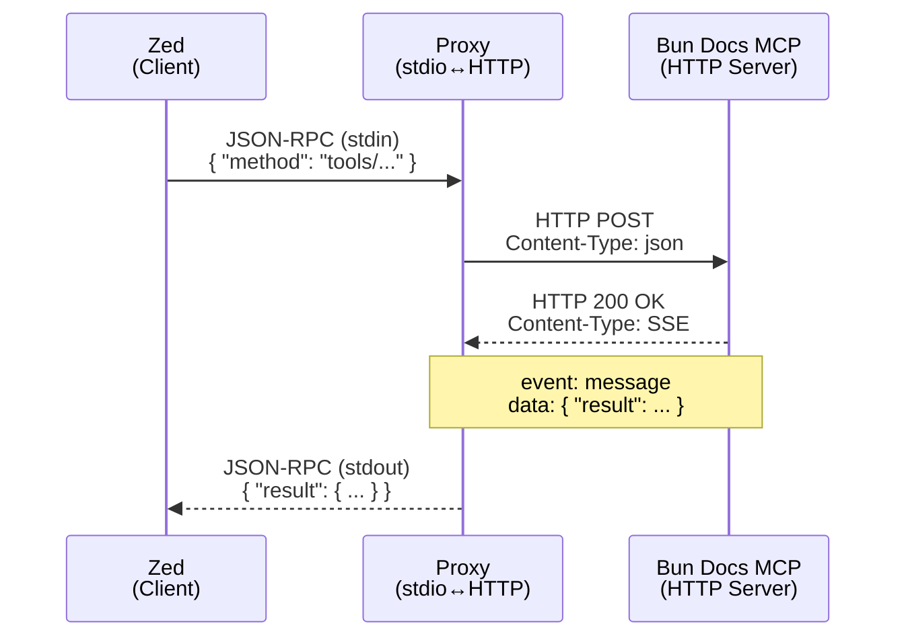

# MCP Protocol Analysis - Bun Docs MCP Server

**Date**: 2025-11-02
**Source**: Traffic captured from `bun.com/docs/mcp` HTTP endpoint
**Method**: Direct proxy test with mock JSON-RPC request

## Executive Summary

The Bun Docs MCP server uses **standard Server-Sent Events (SSE)** over HTTP with **newline-delimited JSON-RPC 2.0**
messaging. The protocol is **request-response** (not bidirectional), making it straightforward to proxy between stdio
and HTTP.

### Key Findings

- ✅ **SSE Format**: Standard `event: message\ndata: {...}\n\n` format
- ✅ **JSON-RPC Framing**: Newline-delimited (no Content-Length headers)
- ✅ **Content-Type**: `text/event-stream`
- ✅ **Directionality**: Request-response only (no server-initiated requests)
- ✅ **Transport**: HTTP POST with SSE streaming response

---

## 1. STDIN Message Format (Zed → Proxy)

**Direction**: Client (Zed) to Proxy
**Transport**: stdin (newline-delimited)
**Format**: JSON-RPC 2.0

### Example

```json
{
  "jsonrpc": "2.0",
  "id": 1,
  "method": "tools/call",
  "params": {
    "name": "SearchBun",
    "arguments": {
      "query": "Bun.serve"
    }
  }
}
```

### Characteristics

- **Line-delimited**: Each request is a single line terminated by `\n`
- **No Content-Length**: No HTTP-style framing headers
- **Standard JSON-RPC**: Follows JSON-RPC 2.0 specification
- **MCP Method**: Uses `tools/call` method from MCP protocol
- **Tool Name**: `SearchBun` (the Bun Docs search tool)
- **Arguments**: Query string in `params.arguments.query`

---

## 2. HTTP Request Format (Proxy → Bun Docs)

**Direction**: Proxy to Bun Docs MCP Server
**Transport**: HTTP POST
**Endpoint**: `https://bun.com/docs/mcp`

### Request Headers

```json
{
  "Content-Type": "application/json",
  "Accept": "application/json, text/event-stream"
}
```

### Request Body

The request body is the **same JSON-RPC request** from stdin:

```json
{
  "jsonrpc": "2.0",
  "id": 1,
  "method": "tools/call",
  "params": {
    "name": "SearchBun",
    "arguments": {
      "query": "Bun.serve"
    }
  }
}
```

### Characteristics

- **Method**: POST
- **Content-Type**: `application/json` (request body)
- **Accept Header**: Explicitly requests SSE response (`text/event-stream`)
- **Body**: Direct passthrough of JSON-RPC from stdin

---

## 3. HTTP Response Format (Bun Docs → Proxy)

**Direction**: Bun Docs MCP Server to Proxy
**Transport**: HTTP 200 OK with SSE streaming

### Response Headers

```json
{
  "status": 200,
  "statusText": "OK",
  "headers": {
    "cache-control": "no-cache",
    "content-type": "text/event-stream",
    "transfer-encoding": "chunked",
    "cf-cache-status": "DYNAMIC",
    "server": "cloudflare",
    "date": "Sun, 02 Nov 2025 21:44:15 GMT"
  }
}
```

### Key Headers

| Header              | Value               | Significance             |
|---------------------|---------------------|--------------------------|
| `Content-Type`      | `text/event-stream` | ✅ Standard SSE           |
| `Cache-Control`     | `no-cache`          | SSE responses not cached |
| `Transfer-Encoding` | `chunked`           | Stream-based response    |
| `Server`            | `cloudflare`        | Hosted on CloudFlare CDN |

---

## 4. SSE Stream Format

**Protocol**: Server-Sent Events (W3C standard)
**Event Type**: `message`
**Data Format**: JSON-RPC 2.0 response

### Raw SSE Chunk Example

```
event: message
data: {"result":{"content":[{"type":"text","text":"Title: Deploy a Bun application on Vercel\nLink: https://bun.com/docs/guides/deployment/vercel\nContent: Vercel is a cloud platform..."}]}, "jsonrpc":"2.0","id":1}

```

### SSE Structure

```
event: <event-type>\n
data: <json-payload>\n
\n
```

- **Event Line**: `event: message`
- **Data Line**: `data: <JSON-RPC response>`
- **Terminator**: Double newline (`\n\n`)

### Parsed JSON-RPC Response (from data line)

```jsonc
{
  "jsonrpc": "2.0",
  "id": 1,
  "result": {
    "content": [
      {
        "type": "text",
        "text": "Title: Deploy a Bun application on Vercel\nLink: https://bun.com/docs/guides/deployment/vercel\nContent: Vercel is a cloud platform..."
      },
      {
        "type": "text",
        "text": "Title: Bun APIs\nLink: https://bun.com/docs/runtime/bun-apis\nContent: Bun implements a set of native APIs..."
      }
      // ... more results
    ]
  }
}
```

### SSE Characteristics

- [x] **Standard Format**: Follows W3C SSE specification
- [x] **Event Type**: Always `message` (no custom event types observed)
- [x] **Data Encoding**: JSON-RPC 2.0 response as string
- [x] **Termination**: Standard double-newline separator
- [ ] **No `id:` field**: SSE events don't use `id:` for this use case
- [ ] **No `retry:` field**: No automatic reconnection directive

---

## 5. STDOUT Message Format (Proxy → Zed)

**Direction**: Proxy to Client (Zed)
**Transport**: stdout (newline-delimited)
**Format**: JSON-RPC 2.0

### Example

```json
{
  "jsonrpc": "2.0",
  "id": 1,
  "result": {
    "content": [
      {
        "type": "text",
        "text": "Title: Deploy a Bun application on Vercel\nLink: https://bun.com/docs/guides/deployment/vercel\nContent: ..."
      }
    ]
  }
}
```

### Characteristics

- **Same as data from SSE**: Extracted JSON from SSE `data:` line
- **Newline-terminated**: Single line ending with `\n`
- **Standard JSON-RPC**: Complete response with `id` matching request

---

## 6. Protocol Flow Diagram




---

## 7. Implementation Implications for Rust Proxy

### Message Framing

- ✅ **Stdin**: Use `tokio::io::BufReader::lines()` for newline-delimited reading
- ✅ **Stdout**: Use `stdout.write_all(json + "\n")` for responses
- ✅ **No HTTP framing**: No need for Content-Length parsing

### HTTP Client

- ✅ **POST with JSON body**: Standard `reqwest` POST request
- ✅ **SSE Parsing**: Use `eventsource-stream` or custom parser
- ✅ **Stream Processing**: Async iterator over SSE events

### SSE Parsing Strategy

```rust
// Option A: Use eventsource-stream crate
use eventsource_stream::Eventsource;

let response = reqwest::post(url).json( & request).send().await?;
let mut stream = response.bytes_stream().eventsource();

while let Some(event) = stream.next().await {
    match event {
        Ok(Event { event: "message", data, .. }) => {
            let json_rpc: JsonRpcResponse = serde_json::from_str( &data) ?;
            write_to_stdout(json_rpc) ?;
        }
        Err(e) => eprintln ! ("SSE error: {}", e),
    }
}
```

### JSON-RPC Handling

- ✅ **Direct passthrough**: stdin → HTTP body (no modification)
- ✅ **SSE extraction**: Parse SSE `data:` field → stdout
- ✅ **ID preservation**: Request ID is preserved in response

### Error Handling

- HTTP errors: Return JSON-RPC error response to stdout
- SSE parse errors: Log to stderr, continue stream
- Timeout: 1-second timeout (currently hardcoded)

---

## 8. Critical Validation Results

| Assumption                          | Result          | Evidence                             |
|-------------------------------------|-----------------|--------------------------------------|
| SSE is standard format              | ✅ **CONFIRMED** | Uses `event: message\ndata: ...\n\n` |
| JSON-RPC is newline-delimited       | ✅ **CONFIRMED** | No Content-Length headers            |
| Content-Type is `text/event-stream` | ✅ **CONFIRMED** | HTTP response header                 |
| Protocol is bidirectional           | ❌ **FALSE**     | Request-response only                |
| Multiple SSE event types            | ❌ **FALSE**     | Only `message` events                |
| Requires custom SSE parser          | ❌ **FALSE**     | Standard parser works                |

---

## 9. Recommendations for Rust Implementation

### **✅ Use `eventsource-stream` crate**

- Handles standard SSE parsing
- Provides async stream interface
- No custom parser needed

### **✅ Use newline-delimited JSON-RPC**

- No need for Content-Length framing
- Simple `BufReader::lines()` for stdin
- Single `write_all()` for stdout

### **✅ Use `reqwest` for HTTP client**

- Standard HTTP POST
- SSE streaming response
- Built-in timeout support

### **❌ Don't implement custom SSE parser**

- Standard format works with existing crates
- No special handling needed

### **❌ Don't implement bidirectional protocol**

- Server doesn't send requests to client
- Simple request-response flow

---

## 10. Capture Statistics

**Test Run**: Sun 02 Nov 2025 21:44:15 GMT
**Total Messages Captured**: 5
**Breakdown**:

- STDIN: 1
- HTTP_REQ: 1
- HTTP_RES: 1
- SSE_CHUNK: 1
- STDOUT: 1

**Test Query**: `"Bun.serve"`
**Response Time**: ~292ms (HTTP request to first STDOUT)
**Response Size**: 10 search results with titles, links, content

---

## Conclusion

The Bun Docs MCP protocol is **straightforward to implement** in Rust:

1. **Standard technologies**: JSON-RPC 2.0, SSE, HTTP POST
2. **No custom protocols**: Everything follows existing standards
3. **Simple framing**: Newline-delimited messages
4. **Request-response**: No bidirectional complexity
5. **Crate support**: `eventsource-stream`, `reqwest`, `tokio` handle everything

**Next Step**: Validate `rmcp` SDK can handle this pattern efficiently (Task 2).
