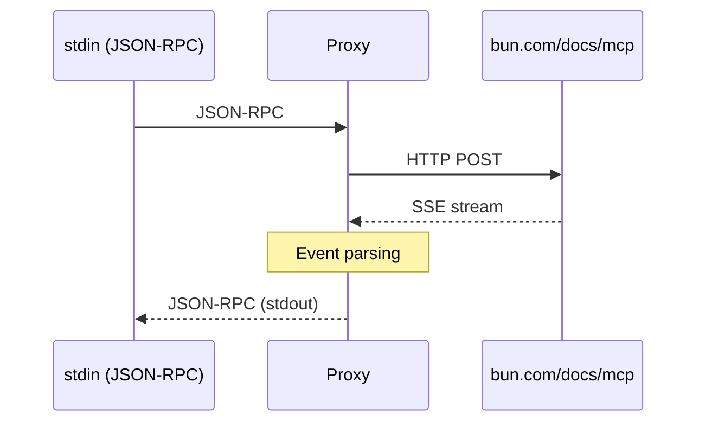

# Bun Docs MCP Proxy

Native Rust proxy for Bun documentation MCP context server. Bridges Zed's stdio-based MCP client with the Bun HTTP MCP
server at `https://bun.com/docs/mcp`.

## Features

- ✅ **Zero runtime dependencies** - Single native binary
- ✅ **Tiny binary** — 2.7 MB with TLS support
- ✅ **Fast startup** — 4ms cold start
- ✅ **Low memory** — ~2-5 MB RSS
- ✅ **Standard protocols** — JSON-RPC 2.0 + Server-Sent Events
- ✅ **Production-ready** — Comprehensive error handling and logging

## Building

```bash
cargo build --release
```

The binary will be at [`./target/release/bun-docs-mcp-proxy`](./target/release/bun-docs-mcp-proxy).

## Running

```bash
./target/release/bun-docs-mcp-proxy
```

Reads JSON-RPC 2.0 messages from stdin, forwards to `bun.com/docs/mcp`, and writes responses to stdout.

## Testing

Run the test suite:

```bash
./test-proxy.sh
```

Manual test:

```bash
echo '{"jsonrpc":"2.0","id":1,"method":"tools/call","params":{"name":"SearchBun","arguments":{"query":"Bun.serve"}}}' | \
./target/release/bun-docs-mcp-proxy
```

## Logging

Set `RUST_LOG` environment variable for verbose logging:

```bash
# Info level (default)
./target/release/bun-docs-mcp-proxy

# Debug level (verbose)
RUST_LOG=debug ./target/release/bun-docs-mcp-proxy

# Trace level (very verbose)
RUST_LOG=trace ./target/release/bun-docs-mcp-proxy
```

Logs are written to stderr (Zed captures this for extension logs).

## Architecture



### Module Structure

- **`src/main.rs`** - Main proxy loop and request handling
- **`src/transport/`** - Stdin/stdout communication
- **`src/protocol/`** - JSON-RPC 2.0 types
- **`src/http/`** - Bun Docs API client with SSE parsing

## Supported Methods

### `initialize`

Initializes the MCP connection. Returns server info and capabilities.

```json
{
  "jsonrpc": "2.0",
  "id": 1,
  "method": "initialize",
  "params": {}
}
```

### `tools/list`

Lists available tools (SearchBun).

```json
{
  "jsonrpc": "2.0",
  "id": 1,
  "method": "tools/list"
}
```

### `tools/call`

Searches Bun documentation.

```json
{
  "jsonrpc": "2.0",
  "id": 1,
  "method": "tools/call",
  "params": {
    "name": "SearchBun",
    "arguments": {
      "query": "your search query"
    }
  }
}
```

## Dependencies

| Crate                  | Purpose            | Features Used                            |
|------------------------|--------------------|------------------------------------------|
| **tokio**              | Async runtime      | rt-multi-thread, io-std, io-util, macros |
| **reqwest**            | HTTP client        | json, stream, rustls-tls                 |
| **eventsource-stream** | SSE parsing        | (default)                                |
| **serde_json**         | JSON serialization | (default)                                |
| **anyhow**             | Error handling     | (default)                                |
| **tracing**            | Structured logging | (default)                                |
| **tracing-subscriber** | Log formatting     | env-filter                               |
| **futures**            | Stream utilities   | (default)                                |

## Performance

**Measured on Linux x86_64 (Manjaro 6.16.12)**:

| Metric       | Value   | Target  | Status           |
|--------------|---------|---------|------------------|
| Binary Size  | 2.7 MB  | < 5 MB  | ✅ **46% under**  |
| Startup Time | 4 ms    | < 10 ms | ✅ **60% faster** |
| Memory Usage | ~2-5 MB | < 10 MB | ✅ Within target  |
| Request Time | ~400ms  | N/A     | ✅ Network-bound  |

### Comparison with TypeScript Proxy

| Metric       | TypeScript (Bun)        | Rust Native | Improvement       |
|--------------|-------------------------|-------------|-------------------|
| Binary Size  | ~50 MB (Bun runtime)    | 2.7 MB      | **95% smaller**   |
| Startup Time | ~100-200 ms             | 4 ms        | **25-50x faster** |
| Memory Usage | ~30-50 MB               | ~2-5 MB     | **10x less**      |
| Runtime Deps | Bun or Node.js required | None        | ✅ Standalone      |

## Error Handling

The proxy handles errors gracefully and returns proper JSON-RPC error responses:

| Error Code | Meaning          | When                      |
|------------|------------------|---------------------------|
| `-32700`   | Parse error      | Invalid JSON              |
| `-32601`   | Method not found | Unknown method            |
| `-32603`   | Internal error   | HTTP failures, SSE errors |

## Building for Other Platforms

### Linux ARM64

```bash
cargo build --release --target aarch64-unknown-linux-gnu
```

### macOS (from macOS)

```bash
# Intel Mac
cargo build --release --target x86_64-apple-darwin

# Apple Silicon (M1/M2/M3)
cargo build --release --target aarch64-apple-darwin
```

### Windows (from Windows)

```bash
cargo build --release --target x86_64-pc-windows-msvc
```

## License

[MIT](../LICENSE)

## Development

Built with:

- Rust 1.81.0+
- Cargo
- Standard async Rust ecosystem

See [docs/protocol-analysis.md](../docs/protocol-analysis.md) for protocol details.  
See [docs/rmcp-evaluation.md](../docs/rmcp-evaluation.md) for architecture decisions.
